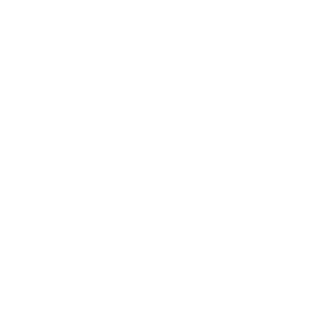
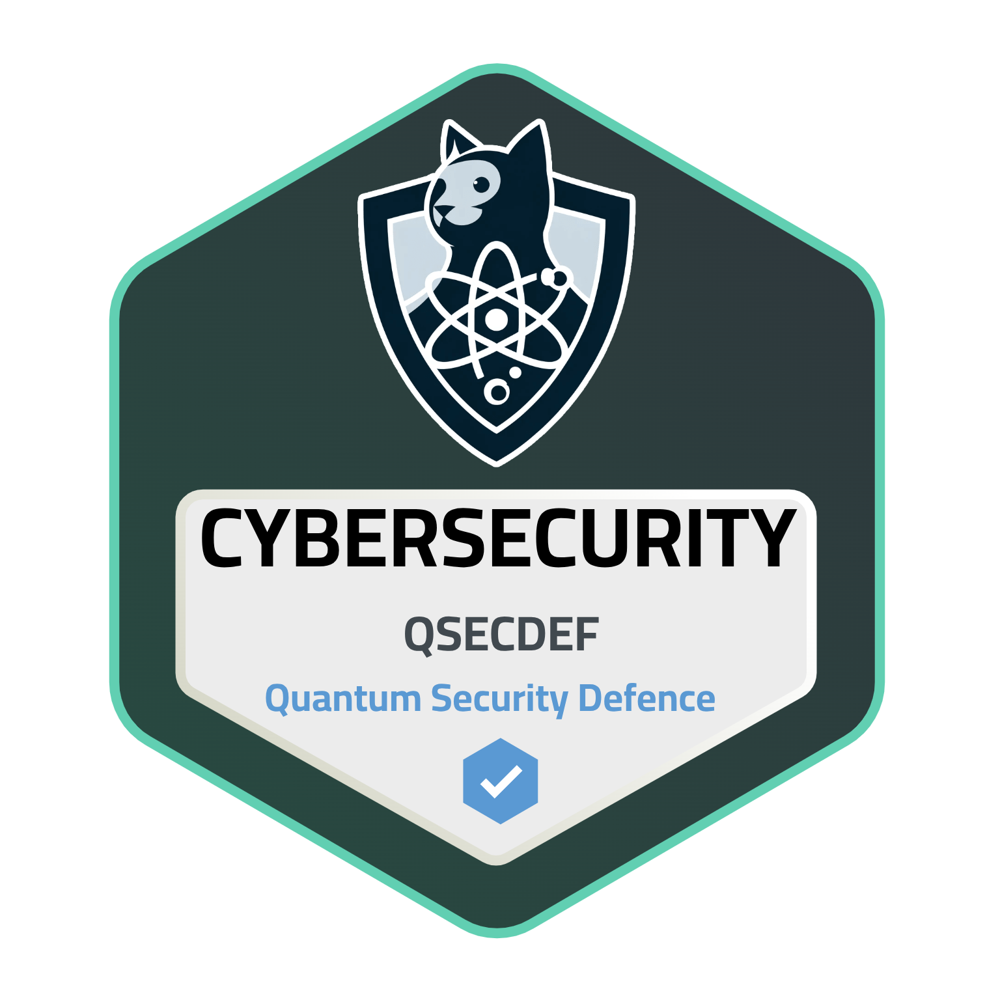
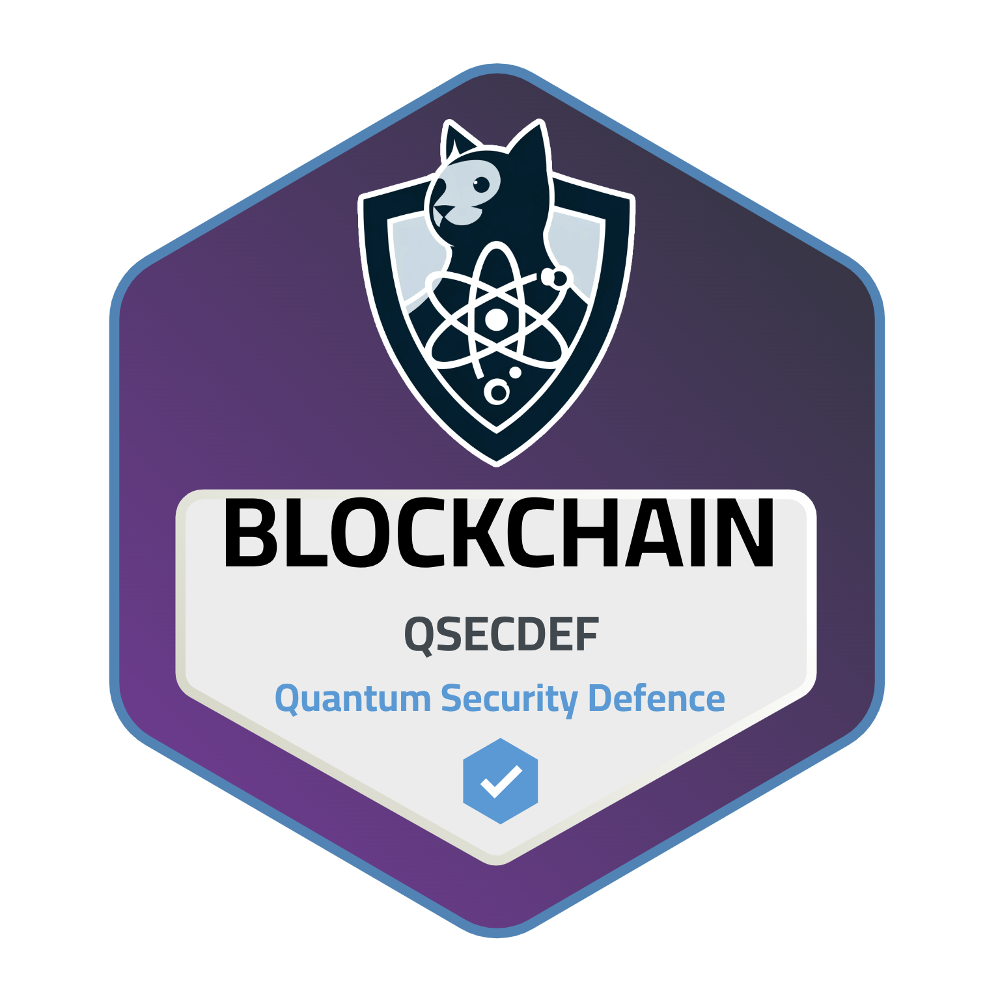

<div align="center">
  
</div>
    
<p align="center">
  
</p>

<p align="center">
    
</p>


## `>(sudojung㉿quantum-node)-[~/identity]`

```bash
└─$ whoami

    ├── Name       : Renzo Cienfuegos
    ├── Alias      : Sudojung / V/ND/X
    ├── Role       : Scientific Computing Student
    ├── University : National University of San Marcos
    ├── Location   : Lima, Peru
    ├── Focus      : Quantum Computing | Cybersecurity | Artificial Intelligence
    ├── Status     : Learning  | Researching | Building
```


## `>(sudojung㉿quantum-node)-[~/profile]`

```bash
└─$ cat about_me.txt

      I am a third-semester student of Scientific Computing at the National University of
      San Marcos (UNMSM), with an interest in cybersecurity, artificial intelligence,
      programming, and quantum computing.

      My learning and research focus is on quantum cybersecurity, with an emphasis on
      post-quantum cryptography (PQC), quantum cryptography, and quantum key
      distribution (QKD), including protocols such as BB84.

      I am also the founder of the Quantum CyberSec Community, an initiative that aims to
      disseminate free resources, simulations, talks, and educational projects to
      democratize access to knowledge about cybersecurity and quantum computing in Peru.

```

```bash
└─$ cat mission.txt

      "Democratizing disruptive learning in cybersecurity and quantum computing"

```


## `> ls skills/`
```bash
└─ Languages
```
<div align="center">

          
</div>

```bash
└─ Frameworks & Libraries
```
<div align="center">

          
</div>

```bash
└─ Tools
```
<div align="center">

             
</div>

```bash
└─ Others
```
<div align="center">


</div>


## `> ls achievements/`
```bash
└─ For Quantum
```
&nbsp;
<a href="https://credsverse.com/credentials/21621192-f451-491d-8bde-b8923d1604c8?preview=1">  </a>
&nbsp;
<a href="https://credsverse.com/credentials/fa1ba927-03d3-4d8f-8205-700735fc4f7b?preview=1">  </a>
```bash
└─ For Cybersecurity
```

```bash
└─ Complementary...
```
